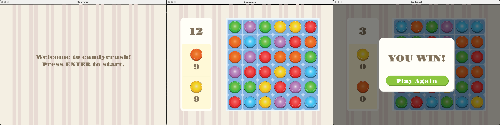

# Candy Crush: Recreated with python


## Project Structure

```
color-by-number/
|── font/                   # fonts
|── image/                  # assets, images, etc
│── candycrush.py           # main game script
│── readme.md
```

## How to use
### 1. Download the project
**Option A — Download ONLY this folder**<br>
If you want just the Candy Crush project (not the entire GameHut repo):
1. Copy this folder link: https://github.com/guoweier/GameHut/tree/main/3_candycrush
2. Go to: https://download-directory.github.io/
3. Paste → download ZIP
4. Unzip and open the folder


**Option B — Download the entire repo**<br>
Click the green Code button → Download ZIP.<br>

Or clone:<br>
```
git clone https://github.com/guoweier/GameHut.git
cd GameHut/3_candycrush
```

### 2. Requirements
- Python 3.10+
- Pygame

Install required libraries:
```
pip install pygame
```

### 3. Run the Game
**Mac / Linux**
```
python3 candycrush.py
```

**Windows**
```
python candycrush.py
```
If Windows opens the Microsoft Store or shows Python errors:<br>
```
py candycrush.py
```

## Support
If you enjoy this project, please consider starring the repo ⭐️ <br>
It helps support GameHut and encourages future mini-games!
