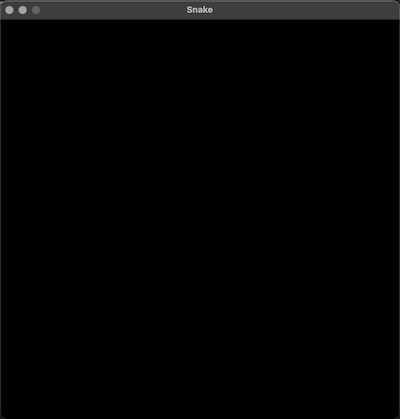
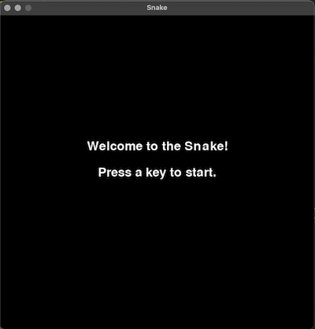
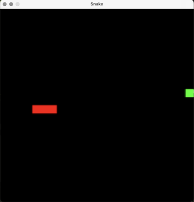
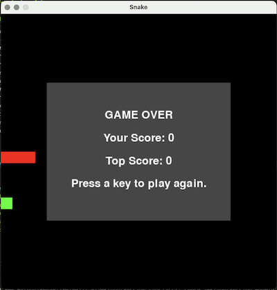

# Programming Beginner: I make a Snake Game with Python! 

My computer: Mac Pro<br>
Coding language: Python<br>
Coding software: VS code<br>
Coding package: pygame<br>
Complete game script: [click here](https://github.com/guoweier/GameHut/blob/main/snake/snake.py)<br>

## Introduction to snake game
Snake is an action video game that is popular for many years. <br>
 <br>
It is a simple to make, so I believe it can be a great practice for programming beginners like me. <br>

## Introduction to pygame package
I decided to make the game in python, since I previously have a little experience on this programming language. <br>
[Pygame](https://www.pygame.org/news) is my go-to package. Pygame is a python module designed for making video games. It contains graphics and sound libraries and specifically suitable for small games like snake. You can install pygame package from [here](https://www.pygame.org/wiki/GettingStarted). <br>
### Preparation
#### First, we create a folder and name it as "snake".
Later, all the python scripts, images, sounds will be stored in this folder. <br>
#### Second, inside this folder, we create a file and name it as "snake.py".
I use VS code for programming. Any type of files can be created directly inside this software. Other text editing softwares are all fine. VS code can be downloaded [here](https://code.visualstudio.com/download). <br>
#### Third, we open snake.py file in the VS code main window and start adding code.
Here are the main blocks of my python script:<br>
1. import essential packages
2. set up variables and functions
3. set up basic elements for the game (window, fonts, sound)
4. set up 3 windows:<br>
    a. start window<br>
    b. game playing window<br>
    c. game over window<br>

### Import essential package
We need to import essential packages first. Here are my codes for pygame package import:<br>
```
1   import pygame, sys, random
2   from pygame.locals import *
```
I import 3 packages: pygame, sys, random.<br>
- **Line 1**: <br>
    - `pygame` is the package for making snake. 
    - `sys` is the module provides access to variables and functions that interact with the computer interpreter. It is always available and no need for installation. 
    - `random` is the module for generating random numbers. We will use its functions when making food during the game. 
- **Line 2**: Besides, I add a line as `from pygame.locals import *`. `pygame.locals` is the module contains many variables that we will use, such as `QUIT`, which helps to quit the program, and `K_ESCAPE`, which represents the `ESC` key on the keyboard. I setup the pygame.locals as `*` when importing it. This can let me use `pygame.locals` without typing `pygame.locals` in front of every method, constant, or anything else call from the moduele. <br>

Now, we are able to program the game. <br>

### Set up variables and functions
There are many variables and block of codes that repeatedly used during this script. We can set them up at the beginning, so then we do not have to type them again and again. Also, if in the future, we would like to change them, we only need to change them once at the beginning. <br>
Here are my variables:<br>
```
4   WINDOWWIDTH = 600
5   WINDOWHEIGHT = 600
6   TEXTCOLOR = (255,255,255)
7   BACKGROUNDCOLOR = (0,0,0)
8   FPS = 10
9   SPACESIZE = 25
10  SNAKECOLOR = (255,0,0)
11  SNAKELENGTH = 3
12  FOODCOLOR = (0,255,0)
```
- **Line 4-5**: `WINDOWWIDTH` and `WINDOWHEIGHT` represent the width and height of the game window. Their units are pixels. I set them both to 600. 
- **Line 6**: `TEXTCOLOR` represents the color of text displayed on the game window. Here I use RGB format to represent the color. I set the text color to be white. 
- **Line 7**: `BACKGROUNDCOLOR` represents the window's background color. I set it to be black.
- **Line 8**: `FPS` (frame per second) controls how fast the game updates. The animation of the game (i.e. the snake move around) is caused by the continueous updates of the window. To keep a consistent moving speed, we need FPS to maintain a fixed frame rate. Here I set it to be 10. 
- **Line 9**: `SPACESIZE` represents the snake and food unit length. In my game, the single unit of snake and food are squares. Food is a single square, snake is composed of several squares. I set the square unit length to be 25 pixels. 
- **Line 10**: `SNAKECOLOR` represents the snake color. I set it to be red. 
- **Line 11**: `SNAKELENGTH` indicates how many square unit of the snake at the start of the game. I set it to be 3. 
- **Line 12**: `FOODCOLOR` represents the food color. I set it to be green. 

Then here are my functions:<br>
1. terminate()
```
14  def terminate():
15      pygame.quit()
16      sys.exit()
```
When the player decides to exit the game, we need to let the game stop, the game window disappears on the computer screen, and the program stop running. This process will be called several times in the script, so we can write them into a function. It is composed of 3 lines: <br>
- **Line 14**: `def terminate():` defines the function name
- **Line 15**: `pygame.quit()` close the game properly without it may leave system background processes running, which can be harmful for the computer. 
- **Line 16**: `sys.exit()` ensures the program fully exits after the pygame module stops. 

2. waitForPlayerToPressKey()
```
18  def waitForPlayerToPressKey():
19      while True:
20          for event in pygame.event.get():
21              if event.type == QUIT:
22                  terminate()
23              if event.type == KEYDOWN:
24                  if event.key == K_ESCAPE: 
25                      terminate()
26                  return 
```
During the game, player can press the key to let the game start, or directly exit the game. When player presses `ESC` key or click `x` button on the window, the game exit; otherwise, any other key pressing will lead to new game start. <br>
- **Line 18**: `def waitForPlayerToPressKey():` defines the function name, 
- **Line 19**: `while True` sets up a loop. This means the game can continuously monitor the player action. It is always looping until it receives the key the player entered. 
- **Line 20**: `for event in pygame.event.get():`: the `pygame.event.get()` checks for any new event objects (i.e. the player presses a key) generated and put them into a list. This line use a for loop to check every event object inside the list. 
- **Line 21-22**: <br>
    ```
    21  if event.type == QUIT:
    22      terminate()
    ```
    Every event object has an attribute called `type`, which tells us the type of the event. When the `type` attribute of the event is equal to the constant variable `QUIT`, which means the player closes the window or the computer shuts down and try to close all the running programs, the script terminates. So we call the terminate() function we defined previously. <br>
- **Line 23-25**: <br>
    ```
    23  if event.type == KEYDOWN:
    24      if event.key == K_ESCAPE: # pressing ESC quits
    25          terminate()
    ```
    When the `type` attribute of the event is equal to `KEYDOWN`, which means the player presses a key on the keyborad. When the pressed key equals to `K_ESCAPE`, which means the player presses `ESC`, the game needs to be terminated. <br>
- **Line 26**: `return` is to exit the `while True` loop. If the player pressed a key and it is not `K_ESCAPE`, we stop the `while True` loop and exit this function, and the program move on to the next step. 

3. drawText()
```
28  def drawText(text, font, surface, x, y):
29      textobj = font.render(text, 1, TEXTCOLOR)
30      textrect = textobj.get_rect()
31      textrect.centerx = x
32      textrect.centery = y
33      surface.blit(textobj, textrect)
```
We will draw lots of text message on the game window during the programming. To do that, we needs to define several parameters such as where the text locates on the window, what the color of the text, etc. So we write them into a function to prevent repetitive typing. <br>
- **Line 28**: `def drawText(text, font, surface, x, y):` defines the function name. This function have several parameters to input. `text` is the message needs to display. `font` is the text font. `surface` represents which surface the text needs to write on. `x` and `y` are the coordinates represent where the text will be written. 
- **Line 29**: `textobj = font.render(text, 1, TEXTCOLOR)` creates a text surface, which can be drawn onto the screen. Some variables are used: `text` is the message needs to display. `1` represents smooth text. `TEXTCOLOR` is the variable we previously defined. We assigned the output to an object named `textobj`. 
- **Line 30**: `textrect = textobj.get_rect()` is to create a rectangular area around the text. This can help to define the position and alignment of text when we draw it onto the screen. We assigned the output to `textrect`. 
- **Line 31-32**: `textrect.centerx = x` and `textrect.centery = y` assign `x` and `y` to the center location of generated text rectangle. We want the text to be centered on the screen, so we defined their center location at the begninning. 
- **Line 33**: `surface.blit(textobj, textrect)` draws `textobj` onto the `surface` at location `textrect`. 

### Set up window, fonts, sound
We start with setting up some initial parameters. First, set up the game window. Here are my code: <br>
```
36  pygame.init()
37  mainClock = pygame.time.Clock()
38  windowSurface = pygame.display.set_mode((WINDOWWIDTH, WINDOWHEIGHT))
39  pygame.display.set_caption('Snake')
40  pygame.mouse.set_visible(False)
```
- **Line 36**: `pygame.init()` needs to be called for every pygame program. It always called just after importing `pygame` module and before any `pygame` functions. It includes some very basic functions such as `pygame.display`, which can manage game window, and `pygame.mixer`, which can handle music. 
- **Line 37**: `mainClock = pygame.time.Clock()` can help ensure smooth animation and prevent the game running too fast. Snake game contains a snake that can move automatically in every unit time. This line of code is set up to control the speed of the snake. 
- **Line 38**: `windowSurface = pygame.display.set_mode((WINDOWWIDTH, WINDOWHEIGHT))` sets up the window. This is the window our game will be. The window width and height are the variables defined before. 
- **Line 39**: `pygame.display.set_caption('Snake')` sets the window title to 'Snake'. 
- **Line 40**: `pygame.mouse.set_visible(False)` sets the mouse cursor to be invisible during the game. 

Next, I set up sounds and font for the game. <br>
```
43  gameOverSound = pygame.mixer.Sound('gameover.mp3')
44  pygame.mixer.music.load('Soundbackground_CasaRosa.mp3')
47  font = pygame.font.SysFont(None, 36)
```
I would like to have two different music: one during the game playing, the other for the game over window. I save the music in the same folder of this python script. <br>
- **Line 43**: `gameOverSound = pygame.mixer.Sound('gameover.mp3')` loads the gameover.mp3 music. 
- **Line 44**: `pygame.mixer.music.load('Soundbackground_CasaRosa.mp3')` loads the background music Soundbackground_CasaRosa.mp3. 
- **Line 47**: `font = pygame.font.SysFont(None, 36)` creates font object. `None` means we have using the default system font. `36` is the font size. 

We have finished initial parameters setting. Currently, these code will give us a window like this:<br>
 <br>
We will have a 600x600 black background window. The window title is Snake. <br>
Now, let's start adding contents! <br>

I designed 3 windows for my snake game:<br>
1. window1: Start window
2. window2: Game playing window
3. window3: Game over window
Here are my pseudocode for arranging 3 windows:<br>
```
#window1
Code for window1
while True: # 1st loop
    #window2
    code for window2 initialization
    while True: # 2nd loop
        code for window2 reactions during the game
        break the 2nd loop if game over
    #window3
    code for window3
    if the player start a new round:
        continue 1st loop
    elif the player terminate the program:
        break the 1st loop
```
I set up two while loops for game running. The 1st loop controls the program, when it stops, the program terminates. The 2nd loop is nested inside the first loop, it controls the game playing (window2). When it monitors game over, it stops and display window3. This will be our to-do list. We will recall it several times later to check where we are. <br>
Now, let's discuss details in each window. <br>

## window1: start window
First, let's take a look of my start window:<br>
 <br>
This is the window initially jumps out when the player open the game. It has two messages centered on the black screen. Specifically, when the player press a key (except `ESC`), the game will jump to game playing window. Here are my code for making the start window:<br>
```
50  windowSurface.fill(BACKGROUNDCOLOR)
51  drawText('Welcome to the Snake!', font, windowSurface, windowSurface.get_rect().centerx, windowSurface.get_rect().centery-50)
52  drawText('Press a key to start.', font, windowSurface, windowSurface.get_rect().centerx, windowSurface.get_rect().centery)
53  pygame.display.update()
54  waitForPlayerToPressKey()
```
- **Line 50**: `windowSurface.fill(BACKGROUNDCOLOR)` fills the window with `BACKGROUNDCOLOR`, which is black, as we defined before. 
- **Line 51**: `drawText('Welcome to the Snake!', font, windowSurface, windowSurface.get_rect().centerx, windowSurface.get_rect().centery-50)` uses previously defined `drawText()` function to write the first message. We input necessary parameters into the function. Notice the `x` and `y` are `windowSurface.get_rect().centerx` and `windowSurface.get_rect().centery-50` respectively. Remember we assigned `x` and `y` as the center location of the text. Since we want the text to be centered on the screen, here the input `x` and `y` should be the center of the game window. So we set the whole window into a rectangular object and take its centerx and centery. I would like the first message to be slightly above the vertical center, so I minus 50 pixels for centery. 
- **Line 52**: `drawText('Press a key to start.', font, windowSurface, windowSurface.get_rect().centerx, windowSurface.get_rect().centery)` is similar as the previous code line. 
- **Line 53**: `pygame.display.update()` tells the pygame to refresh the screen because we have added two new messages to the window. 
- **Line 54**: `waitForPlayerToPressKey()` runs the function we previously defined. Notice the second message asks the player to press a key to start the game. This message can have a reaction when player make an input. All the required reaction are written in the previous defined `waitForPlayerToPressKey()` function. We only need to run the function here. (See how convenient functions are!)

That is everything we need for window1. Let's take a look for the pseudocode of the game structure, and check the things we have done:<br>
```
# window1
Code for window1 (DONE!)
while True: # 1st loop
    # window2
    code for window2 initialization
    while True: # 2nd loop
        code for window2 reactions during the game
        break the 2nd loop if game over
    # window3
    code for window3
    if the player start a new round:
        continue 1st loop
    elif the player terminate the program:
        break the 1st loop
```

## window2: game playing window
 <br>
After the player press a key (except `ESC`), the start window jumps to the game playing window. This is the window we normally see when playing the snake game. Let's discuss what properties this window have:<br>
1. It contains a "food" and a "snake". In my game, the food is a green square. The snake consists of 3 red squares. Initially, the snake is moving toward left. 
2. When the player press direction buttons (left, right, up, down) or WASD buttons on keyboard, the snake can change the moving direction corresponded to the pressed key. 
3. When the snake head touch the food, the food disappear, the snake add one square, and a new food appear at a random position on the screen. 
4. When the snake touch the window edge, game over. 
5. The program record the score during the game. When the snake eats a food, score+1. It can also keep a top score for all the games played. 

Now, let's code to achieve these properties.<br>
### 1. Create the snake and the food. 
#### 1.1 Create the snake.
The snake is composed of 3 red squares. We can create 3 squares, and store their information (i.e. position, color, moving direction) in a list. Here are my code:<br>
```
62  snake = []
63  snakeX = WINDOWWIDTH/2
64  snakeY = WINDOWHEIGHT/2
65  for i in range(SNAKELENGTH):
66      snake.append((snakeX+i*SPACESIZE, snakeY))
67  direction = (-SPACESIZE, 0)
```
- **Line 62**: `snake = []` sets an empty list and names it as snake. This list will store 3 squares information later.
- **Line 63-64**: `snakeX = WINDOWWIDTH/2` and `snakeY = WINDOWHEIGHT/2` define the initial positions for snake. Here I set them to appear in the center of the window. 
- **Line 65-66**: Next, I use a for loop to create squares and add them into the snake list. 
    - **Line 65**: `for i in range(SNAKELENGTH):` starts the for loop. `SNAKELENGTH` is previously defined, which is 3 and represents 3 body units(squares). `range(SNAKELENGTH)` creates a sequence of numbers from 0 to SNAKELENGTH-1, which is [0,1,2]. So this loop will run `SNAKELENGTH` (3) times, using `i` as the index. 
    - **Line 66**: `snake.append((snakeX+i*SPACESIZE, snakeY))` adds created squares into the snake list. Each square information is stored in a tuple `(snakeX+i*SPACESIZE, snakeY)`, where `snakeX+i*SPACESIZE` and `snakeY` represent the i-th square's positions on the x and y coordinates, respectively. `snakeX+i*SPACESIZE` offsets each square by a fixed amount (SPACESIZE). `snakeY` keeps all squares on the same y-coordiate. For example, if i=0, which is the first square, then x = snakeX+0\*SPACESIZE = WINDOWWIDTH/2, y = snakeY = WINDOWHEIGHT/2. If i=1, which is the second square, then x = snakeX+1\*SPACESIZE = WINDOWWIDTH/2+SPACESIZE, y = WINDOWHEIGHT/2. What we see on the screen is two squares next to each other. After this for loop, the snake list will have 3 tuples, each tuple carries the x- and y-coordinates of 1 square, and these 3 squares should display next to each other into a horizontal order when draw them on the screen later. 
- **Line 67**: `direction = (-SPACESIZE, 0)` defines the inital moving direction of the snake. It creates the x- and y-coordinates of the snake position at next unit time. Pygame will update the window in a fixed speed. Let's say we want the snake to move left for 1 square unit (SPACESIZE) during 1 unit time. If the current position is (x=0,y=0), then after 1 unit time, the position is (x=-SPACESIZE, y=0). We assigned snake's next unit time position in `direction`. 

#### 1.2 Create the food.
The food is a green square. It can randomly appear on the screen. Here is my code:<br>
```
69  food = (random.randint(0,((WINDOWWIDTH//SPACESIZE)-1))*SPACESIZE, random.randint(0,((WINDOWHEIGHT//SPACESIZE)-1))*SPACESIZE)
```
We stored x- and y-coordinates of the food in a tuple, and name the variable as `food`. Here we divide the window into a grid, with each cell as one square unit. This can help the food and the snake to align with each other.<br>
- **Line 69**: `random.randint(0,((WINDOWWIDTH//SPACESIZE)-1))*SPACESIZE` represents the x-cooridate. 
    - `WINDOWWIDTH//SPACESIZE` divides the total window width by the space size to determine how many possible positions exist along the x-axis. 
    - `-1` is to make sure the food not placed out of the border. 
    - `random.randint(0,((WINDOWWIDTH//SPACESIZE)-1))` takes a random integer from 0 to the largest x-axis position.
    - `*SPACESIZE` converts the grid index back to actual pixel value. 
- **Line 69**: `random.randint(0,((WINDOWHEIGHT//SPACESIZE)-1))*SPACESIZE` represents the y-coordiate. It is the same defining logic as x-coordinate. 

#### 1.3 Play game playing music
We can also start music playing at this point. Here is my code:<br>
```
70  pygame.mixer.music.play(-1,0.0)
```
- **Line 70**: <br>
    - `pygame.mixer.music.play` is to start playing loaded music. 
    - `-1` is to loop the music forever.
    - `0.0` is to start playing at 0.0 second. 

### 2. Define snake direction change
The computer reacts according to the input key from the player. Here are my code:<br>
```
73  for event in pygame.event.get():
74      if event.type == QUIT:
75          terminate()
76      elif event.type == KEYDOWN:
77          if event.key == K_ESCAPE:
78              terminate()
79          elif (event.key == K_LEFT or event.key == K_a) and direction != (SPACESIZE, 0):
80              direction = (-SPACESIZE, 0)
81          elif (event.key == K_RIGHT or event.key == K_d) and direction != (-SPACESIZE, 0):
82              direction = (SPACESIZE, 0)
83          elif (event.key == K_UP or event.key == K_w) and direction != (0, SPACESIZE):
84              direction = (0, -SPACESIZE)
85          elif (event.key == K_DOWN or event.key == K_s) and direction != (0, -SPACESIZE):
86              direction = (0, SPACESIZE)
```
- **Line 73-78**:
    ```
    73  for event in pygame.event.get():
    74      if event.type == QUIT:
    75          terminate()
    76      elif event.type == KEYDOWN:
    77          if event.key == K_ESCAPE:
    78              terminate()
    ```
    This block of code has been seen in the function `waitForPlayerToPressKey()`. Yes, we have to make sure if the player click x button on the window, the program terminate. <br>
- We set both direction arrow buttons and WASD buttons to control the direction change. 
    - **Line 79-80**:
        ```
        79  elif (event.key == K_LEFT or event.key == K_a) and direction != (SPACESIZE, 0):
        80      direction = (-SPACESIZE, 0)
        ```
        If the player presses left button or A button, and meanwhile the current direction is not toward right (a snake moving right cannot go backward), we define the direction to be left. <br>
    - **Line 81-86**:
        ```
        81  elif (event.key == K_RIGHT or event.key == K_d) and direction != (-SPACESIZE, 0):
        82      direction = (SPACESIZE, 0)
        83  elif (event.key == K_UP or event.key == K_w) and direction != (0, SPACESIZE):
        84      direction = (0, -SPACESIZE)
        85  elif (event.key == K_DOWN or event.key == K_s) and direction != (0, -SPACESIZE):
        86      direction = (0, SPACESIZE)
        ```
        Similar as the previous code block, to define direction change for right, up and down, respectively. <br>

### 3. Snake move and eat food
#### 3.1 Snake move
When the snake move 1 square unit left, it is equivalent to add a new square on the left of the current snake, and subtract the last square on the right end of the snake. Here are my code:<br>
```
90  new_head = (snake[0][0]+direction[0], snake[0][1]+direction[1])
91  snake.insert(0, new_head)
```
- **Line 90**: `new_head = (snake[0][0]+direction[0], snake[0][1]+direction[1])` is to define the new square position. `snake[0][0]` is the x-coordinate value of the first square of the snake list, which is the current snake head. `+direction[0]` adds the direction for the x-axis. `snake[0][1]+direction[1]` represents y-coordinate and is similar as x-axis. We assign this position tuple to variable `new_head`. 
- **Line 91**: `snake.insert(0, new_head)` adds the `new_head` to the front of the snake list. 
For removing the last square of the snake, we will write the code in the next sub-section: snake eat food. <br>

#### 3.2 Snake eat food
Now let's see how I code when the snake head meets the food:<br>
```
94  if new_head == food:
95      food = (random.randint(0,((WINDOWWIDTH//SPACESIZE)-1))*SPACESIZE, random.randint(0,((WINDOWHEIGHT//SPACESIZE)-1))*SPACESIZE)
97  else:
98      snake.pop()
```
- **Line 94**: `if new_head == food:`: When the snake head overlaps with the food, their x- and y-coordinates become the same. So we can write an `if` condition as `new_head == food`. 
- **Line 95**: When this condition is achieved, the program needs to do the following things:<br>
    1. the original food disappear
    2. a new food appears at a random position
    3. the snake add 1 square unit. 
    For 1 and 2, we can assign a new random (x,y) value to the `food` variable. This will replace the original food position into the new one. My code is: `food = (random.randint(0,((WINDOWWIDTH//SPACESIZE)-1))*SPACESIZE, random.randint(0,((WINDOWHEIGHT//SPACESIZE)-1))*SPACESIZE)`. <br>
    For 3, remember in **3.1**, we already add a new_head to the snake, which means the snake is already 1 unit longer than the original one. If it does eat the food, we just do nothing! <br>
- **Line 97-98**: But what if the snake does not meet the food? Then we need to subtract the last square in the snake list. My code is: <br>
    ```
    97  else:
    98      snake.pop()
    ```
    - **Line 97**: `else:` means new_head does not equal to food position. 
    - **Line 98**: `snake.pop()` is to remove the last square in the snake list. 

### 4. Check collision
When the snake touch the window border, game over. Here are my codes:<br>
```
100 if new_head[0] < 0 or new_head[0] >= WINDOWWIDTH or new_head[1] < 0 or new_head[1] >= WINDOWHEIGHT or new_head in snake[1:]:
103     break
```
- **Line 100**: When the snake touch left window border, it's head's x-coordinate is smaller than 0, so `new_head[0] < 0`. When touch right border, it;s x-coordinate is larger than `WINDOWWIDTH`, so `new_head[0] >= WINDOWWIDTH`. It is similar for touching top and bottom borders, where is the comparison been y-coordinate and the `WINDOWHEIGHT`. So, we can connect these 4 conditions into one code line: `if new_head[0] < 0 or new_head[0] >= WINDOWWIDTH or new_head[1] < 0 or new_head[1] >= WINDOWHEIGHT or new_head in snake[1:]:`, meaning either one of these 4 conditions are fulfilled, game over. 
- **Line 103**: `break`: When the snake touch the border, we just call break, and the 2nd loop ends. Simple, right?

### 5. Record score
We have 2 variables used for recording the scores: one is the current score, the othe is the top score. When the snake eats a food, current score adds 1 point; The top score represents the highest score for all the rounds played when the program is running. Here are my pseudocodes:<br>
```
57  topScore = 0
58  while True: # 1st while loop, for controling the program
59      score = 0
        # initialized snake and food
        while True: # 2nd while loop, for monitoring the game playing 
            # direction change
            # snake move
            # snake eat food
94          if new_head == food:
95              food = (random.randint(0,((WINDOWWIDTH//SPACESIZE)-1))*SPACESIZE, random.randint(0,((WINDOWHEIGHT//SPACESIZE)-1))*SPACESIZE)
96              score += 1
            # check collision
100          if new_head[0] < 0 or new_head[0] >= WINDOWWIDTH or new_head[1] < 0 or new_head[1] >= WINDOWHEIGHT or new_head in snake[1:]:
101              if score > topScore:
102                  topScore = score
103           break
        # display game over window (window3)
        # if the player stop the program, break the 1st loop, close the program. 
```
- **Line 57**: `topScore = 0` variable sets up before the 1st while loop starts. 
- **Line 59**: `score = 0` represents the current score for every game round. It sets up inside the 1st while loop and before the 2nd while loop. 
- **Line 96**: `score += 1`: Inside the snake eat food code block, when then snake eats a food, score adds 1 point. 
- **Line 101-102**: <br>
    ```
    101 if score > topScore:
    102     topScore = score
    ```
    Inside the check collision code block, when the game over, if current score larger than topScore, update the new topScore. <br>

Now we have 5 properties all set up for the game playing window! We have a moving snake, a food. The snake can eat the food, and snake dies when touch the borders. <br>

### Run window2 
Now let's draw these elements onto the window and let the game running. Here are my code:<br>
```
105 # draw the game world on the window
106 windowSurface.fill(BACKGROUNDCOLOR)
107 # draw food
108 pygame.draw.rect(windowSurface, FOODCOLOR, (food[0], food[1], SPACESIZE, SPACESIZE))
109 # draw snake
110 for bodypart in snake:
111     pygame.draw.rect(windowSurface, SNAKECOLOR, (bodypart[0], bodypart[1], SPACESIZE, SPACESIZE))
112 # update window2
113 pygame.display.flip()
114 mainClock.tick(FPS)
```
- **Line 106**: `windowSurface.fill(BACKGROUNDCOLOR)` fill the window with black background. 
- **Line 108**: `pygame.draw.rect(windowSurface, FOODCOLOR, (food[0], food[1], SPACESIZE, SPACESIZE))` draws the food as a rectangle on the window surface. 
    - `pygame.draw.rect()` draw the rectangle
    - `windowSurface` is the surface where rectangle will draw
    - `FOODCOLOR` is the color of the food. 
    - `(food[0], food[1], SPACESIZE, SPACESIZE)` represents the position (x,y) and the size (width, height) of the food. 
- **Line 110-111**:
    ```
    for bodypart in snake:
        pygame.draw.rect(windowSurface, SNAKECOLOR, (bodypart[0], bodypart[1], SPACESIZE, SPACESIZE))
    ```
    Draws the snake on the window surface. Remember the snake is a list containing square units. So I use a for loop to draw these squares. <br>
    - **Line 110**: `for bodypart in snake` takes each square by index in the snake list.
    - **Line 111**: `pygame.draw.rect(windowSurface, SNAKECOLOR, (bodypart[0], bodypart[1], SPACESIZE, SPACESIZE))` draws the square on the window surface as a rectangle. The format is the same as we drawing the food in previous step. 
- **Line 113**: `pygame.display.flip()` refreshes the entire screen, making changes visible. 
- **Line 114**: `mainClock.tick(FPS)` controls screen update rate. 

That is everything we need for window2. Let's recall the pseudocode of the game structure, and mark the things we have done:<br>
```
# window1
Code for window1 (DONE!)
while True: # 1st loop
    # window2
    code for window2 initialization (DONE!)
    while True: # 2nd loop
        code for window2 reactions during the game (DONE!)
        break the 2nd loop if game over (DONE!)
    # window3
    code for window3
    if the player start a new round:
        continue 1st loop
    elif the player terminate the program:
        break the 1st loop
```

## window3: Game over window
 <br>
On window3, we can see the following properties:<br>
1. The background is the dead screen from window2. 
2. The game music changed to game over music. 
3. There is a white semi-transparent rectangle in the middle. 
4. 4 messages on the white rectangle. 

Now let's code to achieve these properties:<br>
### 1. Background is the dead screen from window2
Since we are directly using the dead screen from window2, nothing needs to do for the background!<br>

### 2. Change the music
```
117 pygame.mixer.music.stop()
118 gameOverSound.play()
```
- **Line 117**: `pygame.mixer.music.stop()` stops the music that is currently playing.
- **Line 118**: `gameOverSound.play()` plays the gameOverSound. 

### 3. Add a white semi-transparent rectangle
```
120 transparent_surface = pygame.Surface((400,300))
121 transparent_surface.fill((255, 255, 255))
122 transparent_surface.set_alpha(70)
123 surface = transparent_surface.get_rect()
124 surface.centerx = windowSurface.get_rect().centerx
125 surface.centery = windowSurface.get_rect().centery
126 windowSurface.blit(transparent_surface, surface)
```
- **Line 120**: `transparent_surface = pygame.Surface((400,300))` sets up a surface with width=400 and height=300 and name it as `transparent_surface`. 
- **Line 121**: `transparent_surface.fill((255, 255, 255))` sets the color to be white. 
- **Line 122**: `transparent_surface.set_alpha(70)` sets the transparency to be 70%.
- **Line 123**: `surface = transparent_surface.get_rect()` creates a rectangular area around the `transparent_surface`. This will help define the alignment and position of the object. 
- **Line 124-125**: `surface.centerx = windowSurface.get_rect().centerx` and `surface.centery = windowSurface.get_rect().centery` set up x- and y-coordinates of the transparent rectangle. It will let the rectangle centered on the window. 
- **Line 126**: `windowSurface.blit(transparent_surface, surface)` draws `transparent_surface` onto the `windowSurface` at location `surface`.

### 4. Display 4 messages
```
127 drawText("GAME OVER", font, windowSurface, windowSurface.get_rect().centerx, windowSurface.get_rect().centery-80)
128 drawText(f"Your Score: {score}", font, windowSurface, windowSurface.get_rect().centerx, windowSurface.get_rect().centery-30)
129 drawText(f"Top Score: {topScore}", font, windowSurface, windowSurface.get_rect().centerx, windowSurface.get_rect().centery+20)
130 drawText("Press a key to play again.", font, windowSurface, windowSurface.get_rect().centerx, windowSurface.get_rect().centery+70)
```
Basically, I use the previously defined function `drawText()` to display 4 messages. The input parameters are: <br>
    - message content
    - font type
    - surface to display
    - x-coordinate
    - y-coordinate
I use a f-string to display variables such as score and topScore. <br>

Now, we update and displayed the window3 on the screen. Here are my code:<br>
```
131 pygame.display.update()
```
- **Line 131**: `pygame.display.update()` refreshed the screen. 

Notice the 4th message is to ask the player to press a key for starting a new round. To do that, we only need to call the function `waitForPlayerToPressKey()`. <br>
```
132 waitForPlayerToPressKey()
```
Everything we needs are already defined in this function: if it is `ESC` key or click x button, 1st while loop stops and program terminate; if it is any other key, starts a new round. <br>

That is everything we need for window3. Let's take a look for the pseudocode of the game structure, and check the things we have done:<br>
```
# window1
Code for window1 (DONE!)
while True: # 1st loop
    # window2
    code for window2 initialization (DONE!)
    while True: # 2nd loop
        code for window2 reactions during the game (DONE!)
        break the 2nd loop if game over (DONE!)
    # window3
    code for window3 (DONE!)
    if the player start a new round: (DONE!)
        continue 1st loop (DONE!)
    elif the player terminate the program: (DONE!)
        break the 1st loop (DONE!)
```

WoW! Everything is done! We make the Snake Game! <br>
One last thing, we can add a line of code to stop the game over music at the end, to prevent the music continueous play after the program is terminated. <br>
```
133 gameOverSound.stop()
```

## Run the program
We can run the python script in terminal to play the game!<br>
### Open a terminal window
If using VS code, you can open a new Terminal window using the top bar: Terminal > New Terminal; or press control+shift+`. A new terminal window will appear on the bottom. <br>
### Go to the folder where contains the python script. 
In the terminal window, run command: `cd /path_to_snake_folder/` <br>

### Run program
In the terminal window, run command: `python snake.py` <br>
We wait for several seconds, and will see a new window jumps out. This is the game window! Feel free to enjoy the snake game! <br>

## Conclusion
This article introduces how to make a snake game using python. To sum up, it consists of these aspects:<br>
1. import essential packages (pygame, sys, random)
2. set up variables and functions
3. set up basic elements for the game (window, fonts, sound)
4. set up 3 game windows: <br>
    a. start window<br>
    b. game playing window<br>
    c. game over window<br>
5. Run the program


The full python script can be found [here](https://github.com/guoweier/GameHut/blob/main/snake/snake.py). <br>

Hope you enjoy it! <br>


