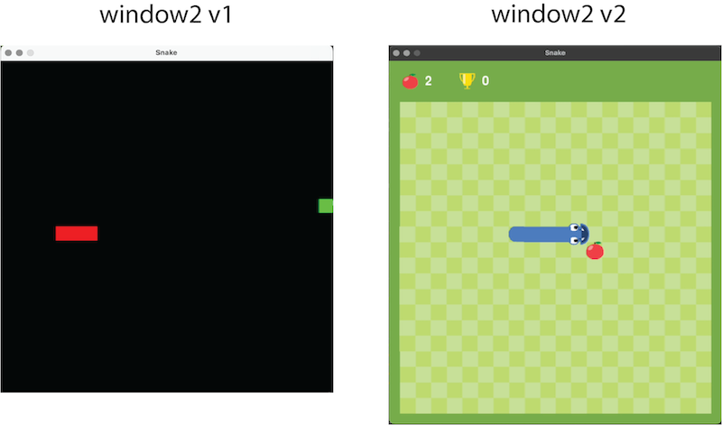

# Programming Learning Report #2: How I made snake game from basic to advance?

My computer: Mac Pro<br>
Coding language: Python<br>
Coding software: VS code<br>
Coding package: pygame<br>
Complete source code: [click here](https://github.com/guoweier/GameHut/blob/main/snake/snake_v2.py)<br>

Last time, I made a snake game using pygame. <br>
<br>
It is simple and workable. But I would like it to be more cute. So I updated it, and now the advanced version looks like this:<br>
<br>

What a big difference!<br>
I use google snake game as the reference. Now, let me introduce how I did that. 

## Review for snake v1
Before we start, let's have a quick review of what we've done in snake v1. (Detailed [tutorial](tutorial_snake_v1.md) and [source code](https://github.com/guoweier/GameHut/blob/main/snake/snake_v1.py))<br>
In snake v1, we have 3 windows:<br>
1. start window
    - welcome message
2. game playing window
    - animated snake can eat food, and die if it touches the border
3. game over window
    - score board

My main coding structure looks like this:<br>
```
# window1
Code for window1 
while True: # 1st loop
    # window2
    code for window2 initialization
    while True: # 2nd loop
        code for window2 reactions during the game
        break the 2nd loop if game over
    # window3
    code for window3
    if the player start a new round:
        continue 1st loop
    elif the player terminate the program:
        break the 1st loop
```

## Differences between v1 and v2
We notice these differences between v1 and v2: <br>
1. window1 (start window)<br>
<br>
    | Event       | v1      | v2      |
    |-------------|---------|---------|
    | background  | black   | green   |
    | window size | 600x600 | 640x700 |

2. window2 (game playing window)<br>
<br>
    | Event    | v1             | v2                                                               |
    |----------|----------------|------------------------------------------------------------------|
    | window   | 600x600 black  | 640x700 green window, 600x600 plaid game board, score bar on top |
    | food     | 1 green square | cute apple image, glowing                                        |
    | snake    | 3 red squares  | cute snake image, open mouth when close to the food              |
    | scorebar | None           | show current score and top score on top of window                |

3. window3 (game over window)<br>
<br>
    | Event      | v1                       | v2                                   |
    |------------|--------------------------|--------------------------------------|
    | snake      | no animation             | blink eyes                           |
    | scoreboard | white square, 4 messages | cute image, scores shown with symbol |

Let's dissect them one by one. 

## window1: start window
1. background: from black to green <br>
```
7   WINDOWCOLOR = (120,172,75)
```
Very simple. I changed the `WINDOWCOLOR` variable to the RGB value that I want. <br>

2. window size: from 600x600 to 640x700
```
5   WINDOWWIDTH = 640
6   WINDOWHEIGHT = 700
```
Simple. I changed the `WINDOWWIDTH` and `WINDOWHEIGHT` to 640 and 700, respectively. <br>

## window2: game playing window
### Window
1. 640x700 green window <br>
```
23  windowSurface = pygame.display.set_mode((WINDOWWIDTH, WINDOWHEIGHT), 0, 32)
278 windowSurface.fill(WINDOWCOLOR)
```
It is the same code as v1 script. I changed the value of `WINDOWCOLOR`, `WINDOWWIDTH` and `WINDOWHEIGHT`, so the background would display as I needed. <br>

2. 600x600 plaid game board <br>
```
8   GAMEWIDTH = 600
9   GAMEHEIGHT = 600

65  def load_image(file, x, y):
66      img = pygame.image.load(file)
67      img = pygame.transform.scale(img, (x,y))
68      return img

77  def draw_image(img, surface, x, y):
78      img_rect = img.get_rect(center=(x,y))
79      surface.blit(img, img_rect)

240 game_background_img = load_image("image/background.png", GAMEWIDTH, GAMEHEIGHT)
279 draw_image(game_background_img, windowSurface, windowSurface.get_rect().centerx, windowSurface.get_rect().centery+30)
```
- **Line 8-9**: `GAMEWIDTH` and `GAMEHEIGHT` represent game board's width and height, which are both 600 pixels. <br>
- **Line 65-68**: define the function for image loading.
    - **Line 65**: 
        - `file`: image file name
        - `x` and `y`: x- and y- pixel values for scale. 
    - **Line 66**: load image
    - **Line 67**: scale image to desired size
    - **Line 68**: return image
- **Line 77-79**: define the function for image drawing. 
    - **Line 77**: 
        - `img`: image to draw
        - `surface`: drawing surface for the image 
        - `x` and `y`: centered x- and y- coordinates
    - **Line 78**: `img_rect = img.get_rect(center=(x,y))`: get a rectangle around image for drawing. Define its centered x- and y- coordinates, so the image would be centered. 
    - **Line 79**: `surface.blit(img, img_rect)`: draw image on the surface with designated position. 

- **Line 240**: Use `load_image()` function to load plaid game board image. (I drew the plaid image using Adobe Illustrator myself. There are many other software that can be used for drawing. Direct downloading is also doable.) Previous defined `GAMEWIDTH` and `GAMEHEIGHT` are used here. <br> 
- **Line 279**: Use `draw_image()` function to draw the game board image on designated position in window2. <br>

3. Score bar on top of the window <br>
```
97  def draw_scorebar(score, topScore, surface):
98      draw_image(score_img, surface, 40, 40)
99      draw_text(f"{score}", font, surface, 75, 40)
100     draw_image(topscore_img, surface, 150, 40)
101     draw_text(f"{topScore}", font, surface, 185, 40)

256 score_img = load_image("image/food.png", 30, 30)
257 topscore_img = load_image("image/champ.png", 30, 30)

329 draw_scorebar(score, topScore, windowSurface)
```
- **Line 97-101**: define the function for drawing the score bar. <br>
    - **Line 97**: 
        - `score`: the current score
        - `topScore`: the highest score
        - `surface`: drawing surface for the scores
    - **Line 98**: Use `draw_image()` function to draw the score symbol (food image). Set x- and y- coordinates to be (40,40). 
    - **Line 99**: Use `draw_text()` function to display current score. Set x- and y- coordinates to be (75,40). 
    - **Line 100**: Use `draw_image()` function to draw the topScore symbol (troph image). Set x- and y- coordinates to be (150,40). 
    - **Line 101**: Use `draw_text()` function to display the top score. Set x- and y- coordinates to be (185,40). 
- **Line 256**: Use `load_image()` function to load score symbol (food image). Set scales to be width=30, height=30. 
- **Line 257**: Use `load_image()` function to load topScore symbol (trophy image). Set scales to be width=30, height=30. 
- **Line 329**: Use `draw_scorebar()` function to draw the score bar on window2. 

### Food
1. Initiate food <br>
```
242 food_img = pygame.image.load("image/food.png")
281 food_pos = (random.randint(0,((GAMEWIDTH//SPACESIZE)-1))*SPACESIZE+0.5*SPACESIZE+GAMELEFT, random.randint(0,((GAMEHEIGHT//SPACESIZE)-1))*SPACESIZE+0.5*SPACESIZE+GAMETOP)
```
- **Line 242**: Load image using `pygame.image.load()` and stored in `food_img`. I drew the cute apple using Adobe Illustrator. <br>
- **Line 281**: Define food position on x- and y- coordinates. 
    - Select a random x integer from left to right border. Remember to add `GAMELEFT` to let food only appear within game board. 
    - Select a random x integer from top to bottom border. Remember to add `GAMELTOP` to let food only appear within game board. 

2. Food glowing during the game <br>
This animation is made by showing 4 different sized apple frames in loop. I made these 4 apple frames into a pygame sprite, but displayed them through customized approach. <br>
```
28  class Sprites(pygame.sprite.Sprite):
29      def __init__(self, frames, speed=2):
30          super().__init__()
31          self.frames = frames
32          self.index = 0
33          self.image = self.frames[self.index]
34          self.timer = 0
35          self.speed = speed
36  
37      def update(self):
38          self.timer += 1
39          if self.timer >= self.speed:
40              self.timer = 0
41              self.index = (self.index+1) % len(self.frames)
42              self.image = self.frames[self.index]

70  def scale_image(image, x, y, units):
71      scaled_images = []
72      for i in range(len(units)):
73          image_scale = pygame.transform.scale(image, (x+units[i],y+units[i]))
74          scaled_images.append(image_scale)
75      return scaled_images

92  def draw_sprite(sprite, x, y, surface, direction=(-SPACESIZE, 0)):
93      sprite.update()
94      img_rt = rotate_image(direction, sprite.image)
95      draw_image(img_rt, surface, x, y)

243 food_scale_units = [0, 2.5, 5, 7.5, 10, 7.5, 5, 2.5]
244 food_frames = scale_image(food_img, 30, 30, food_scale_units)
245 food_sprite = Sprites(food_frames, speed=2)

331 draw_sprite(food_sprite, food_pos[0], food_pos[1], windowSurface)
```
- **Line 28-42**: Define the class for sprite. 
    - **Line 28**: Inherit all basic functions from `pygame.sprite.Sprite` into my own sprite class. 
    - **Line 29-35**: Initiate the elements in my sprite class. 
        - **Line 29**: 
            - `frames`: The list carrying multiple frames (i.e. my food list). 
            - `speed`: Animating speed. Default is 2, meaning every 2 game loop, frame update once. 
        - **Line 30**: Call the `pygame.sprite.Sprite` class constructor. 
        - **Line 31**: Assign input frames into `self.frames`. 
        - **Line 32**: Initiate `self.index` to be 0. 
        - **Line 33**: Get `self.image` according to `self.index`. 
        - **Line 34**: Initate `self.timer` to be 0. 
        - **Line 35**: Assign speed into `self.speed`. 
    - **Line 37-42**: Define function for updating frames during the game loop. 
        - **Line 38**: For every game loop, `self.timer` plus 1. 
        - **Line 39**: When the `self.timer` equals or larger than `self.speed`, update to the next frame. 
        - **Line 40**: Set `self.timer` back to 0, prepare for next loop. 
        - **Line 41**: When move on to the next frame, `self.index`+1. When the `self.index` finishes taking all the frames in `self.frames`, go back to the first frame. 
        - **Line 42**: Get the updated frame based on `self.index`. 
- **Line 70-75**: Define the function for image scaling. 
    - **Line 70**:
        - `image`: image for scaling. 
        - `x` and `y`: the initial width and height of the image. 
        - `units`: the different units between inital (x,y) and designated scales. 
    - **Line 71**: set a list for storing output scaled images. 
    - **Line 72-74**: For each scale unit, scale the input image based on units. Then store scaled image in `scaled_images` list. 
        - `pygame.transform.scale()`: pygame function for scale image. 
        - `(x+units[i],y+units[i])`: width and height of scaled image. 
    - **Line 75**: return `scaled_images` list. 
- **Line 92-95**: Define the function for drawing sprite. 
    - **Line 92**: 
        - `sprite`: sprite defined from class `Sprites`. 
        - `x` and `y`: x- and y- coordinates for image drawing position. 
        - `surface`: drawing surface for the sprite image. 
        - `direction=(-SPACESIZE, 0)`: moving direction of the element. Default is towards left. Not be used for food frames here. But will be used in snake frames later. 
    - **Line 93**: Sse `Sprites` class function `update()` to update frame image. 
    - **Line 94**: Rotate image if necessary (no rotation in food frames).
    - **Line 95**: Use `draw_image()` to draw selected image onto the designated surface. 
- **Line 243**: The food animation is glowing, which is just different sizes of the same apple image. So I set a list of units for image scale. 
- **Line 244**: Use `scale_image()` function to scale food image into different sizes and stored them as `food_frames`. 
- **Line 245**: Set `Sprites` class for food frames and assigned output as `food_sprite`. 
- **Line 331**: Use `draw_sprite` function to display different sized food images every 2 game loops on window2. My scaled food frames are: [30, 32.5, 35, 37.5, 40, 37.5, 35, 32.5]. This mountain shaped curve can be shown like a glowing of food image. 

### Snake
It is composed of 3 parts: snakehead, snakebody, snaketail. <br>
#### Snakehead
1. Initiate snake <br>
```
10  GAMELEFT = (WINDOWWIDTH-GAMEWIDTH)/2
11  GAMERIGHT = (WINDOWWIDTH+GAMEWIDTH)/2
12  GAMETOP = WINDOWHEIGHT-(WINDOWWIDTH+GAMEHEIGHT)/2
13  GAMEBOTTOM = WINDOWHEIGHT-(WINDOWWIDTH-GAMEHEIGHT)/2

247 snakehead_frames = [load_image(f"image/snakehead{i+1}.png", 42.85, 42.85) for i in range(4)]
283 snake = []
284 snakeX = GAMEWIDTH/2
285 snakeY = GAMEHEIGHT/2
286 for i in range(SNAKELENGTH):
287     snake.append((snakeX+(i+0.5)*SPACESIZE+GAMELEFT, snakeY+0.5*SPACESIZE+GAMETOP))
288 direction = (-SPACESIZE, 0)
```
- **Line 10-13**: `GAMELEFT`, `GAMERIGHT`, `GAMETOP`, `GAMEBOTTOM` are the 4 values of game board edges. <br>
- **Line 247**: I have 4 different snakehead images need to load. So I use `load_image()` function to load them and store them in a list. 
- **Line 283**: List for storing snake each unit positions.
- **Line 284-285**: Initial position for x- and y- coordinates of the snake. 
- **Line 286-287**: Add each snake unit positions into the position list `snake`. 
    - I add `0.5*SPACESIZE` for x and y to set up the unit to be centered. 
    - I add `GAMELEFT` and `GAMETOP` value to let snake only move inside game board. 
- **Line 288**: Initial snake moving direction is towards left. 

2. Rotate snakehead image when snake turns <br>
The original snakehead is towards left. When snake turns, I have to rotate the snakehead to show appropriate direction. <br>
```
81  def rotate_image(direction, image):
82      if direction == (-SPACESIZE, 0): # left
83          image_rt = pygame.transform.rotate(image, 0)
84      elif direction == (SPACESIZE, 0): # right
85          image_rt = pygame.transform.rotate(image, 180)
86      elif direction == (0, -SPACESIZE): # up
87          image_rt = pygame.transform.rotate(image, -90)
88      elif direction == (0, SPACESIZE): # down
89          image_rt = pygame.transform.rotate(image, 90)
90      return image_rt

336 snake_head_img_rt = rotate_image(direction, snake_head_img)
```
- **Line 81-90**: define the function for rotate image.
    - **Line 81**: 
        - `direction`: current moving direction of the snake
        - `image`: image to be rotated
    - **Line 82-83**: if current direction towards left, no need for rotation. 
        - `pygame.transform.rotate()` is the function for rotating image. 
        - `0` means no rotation.
        - store output value in `image_rt`. 
    - **Line 84-85**: if current direction towards right, rotate 180 degree. 
    - **Line 86-87**: if current direction towards up, rotate -90 degree. (the default rotating is anticlockwise)
    - **Line 88-89**: if current direction towards down, rotate 90 degree.
    - **Line 90**: return `image_rt`. 
- **Line 336**: Use `rotate_image` function to rotate snakehead image and stored in `snake_head_img_rt`. 

3. Snake open mouth when close to the food <br>
In snakehead loading step, I loaded 4 snakehead images, they are: <br>
- image1: close mouth
- image2: small open mouth
- image3: medium open mouth
- image4: wide open mouth
Normally, the snake only display close mouth (image1). When it locates near the food, it gradually opens the mouth (image2->image3->image4). Specifically, I designed the mouth open in this criteria:<br>
<br>
- When distance between food and snake equals 3 units, show small open mouth.
- When distance between food and snake equals 2 units, show medium open mouth. 
- When distance between food and snake equals or smaller than 1 unit, show wide open mouth. 
```
103 def snakehead_openmouth(dx, dy):
104     if abs(dx)+abs(dy) == 3*SPACESIZE:
105         return snakehead_frames[1]
106     elif abs(dx)+abs(dy) == 2*SPACESIZE:
107         return snakehead_frames[2]
108     elif abs(dx)+abs(dy) <= SPACESIZE:
109         return snakehead_frames[3]
110     else:
111         return snakehead_frames[0]

333 snakehead_pos = snake[0]
334 head_food_dx, head_food_dy = snakehead_pos[0]-food_pos[0], snakehead_pos[1]-food_pos[1]
335 snake_head_img = snakehead_openmouth(head_food_dx, head_food_dy)
337 draw_image(snake_head_img_rt, windowSurface, snake[0][0], snake[0][1])
```
- **Line 103-111**: Define the function for snakehead open mouth when close to food. 
    - **Line 103**: `dx` and `dy` are distance between snakehead and food on x- and y- coordinates. 
    - **Line 104-109**: Use `abs()` function to take the absolute value of `dx` and `dy`. 
        - **Line 104-105**: When distance of snakehead and food equals 3 units, return small open mouth (located at index 1 in `snakehead_frames`). 
        - **Line 106-107**: When distance of snakehead and food equals 2 units, return medium open mouth (located at index 2 in `snakehead_frames`). 
        - **Line 108-109**: When distance of snakehead and food equals or smaller than 1 unit, return wide open mouth (located at index 3 in `snakehead_frames`). 
    - **Line 110-111**: If other conditions, which means snakehead is far from the food, display close mouth snakehead (located at index 0 in `snakehead_frames`). 
- **Line 333**: Get the snakehead position from `snake` position list. Assign it as `snakehead_pos`. 
- **Line 334**: Get snakehead and food distance. 
- **Line 335**: Use `snakehead_openmouth` function to get appropriate snakehead image. 
- **Line 337**: After rotate the snakehead image (in Line 345, see above #2), use `draw_image` function to display the snakehead. 

4. Snakebody display corner when turns <br>
- Snakebody is rectangle. When snake moves horizontal and vertical, the snakebody needs to turn. 
- When snake change direction, on the turning corner, snakebody needs a corner image. 
So I drew 6 different snakebody images: horizontal, vertical, lefttop, leftbottom, righttop, rightbottom. <br>
The turning direction and corner image choosing relationship can be interpreted as follow: <br>
<br>
Set corner as the "current" anchor. Its previous position is "previous", its next position is "next". (A,E) When direction change up->left or right->down, use leftbottom corner. (B,F) When direction change up->right or left->down, use rightbottom corner. (C,G) When direction change down->left or right->up, use lefttop corner. (D,H) When direction change down->right or left->up, use righttop corner. <br>
```
113 def choose_turn_img(dx1, dy1, dx2, dy2):
114     if ((dx1, dy1) == (0, -SPACESIZE) and (dx2, dy2) == (-SPACESIZE, 0)) or ((dx1, dy1) == (SPACESIZE, 0) and (dx2, dy2) == (0, SPACESIZE)): # up -> left & right -> down
115         return snakebody_turn_frames[0]
116     elif ((dx1, dy1) == (0, -SPACESIZE) and (dx2, dy2) == (SPACESIZE, 0)) or ((dx1, dy1) == (-SPACESIZE, 0) and (dx2, dy2) == (0, SPACESIZE)): # up -> right & left -> down
117         return snakebody_turn_frames[1]
118     elif ((dx1, dy1) == (0, SPACESIZE) and (dx2, dy2) == (-SPACESIZE, 0)) or ((dx1, dy1) == (SPACESIZE, 0) and (dx2, dy2) == (0, -SPACESIZE)): # down -> left & right -> up
119         return snakebody_turn_frames[2]
120     elif ((dx1, dy1) == (0, SPACESIZE) and (dx2, dy2) == (SPACESIZE, 0)) or ((dx1, dy1) == (-SPACESIZE, 0) and (dx2, dy2) == (0, -SPACESIZE)): # down -> right & left -> up
121         return snakebody_turn_frames[3]

152 def draw_snakebody(surface):
153     for i in range(1, len(snake)-1):
154         prev = snake[i - 1]
155         curr = snake[i]
156         nxt = snake[i + 1]
157         # check directions
158         dx1, dy1 = curr[0] - prev[0], curr[1] - prev[1]
159         dx2, dy2 = nxt[0] - curr[0], nxt[1] - curr[1]
160         if dx1 == dx2 and dy1 == dy2:
161             # straight segment
162             if dx1 != 0: # horizontal
163                 draw_image(snakebody_hor_img, surface, curr[0], curr[1])
164             else: # vertical
165                 draw_image(snakebody_ver_img, surface, curr[0], curr[1])
166         else: # choose corner
167             turn_img = choose_turn_img(dx1, dy1, dx2, dy2)
168             draw_image(turn_img, surface, curr[0], curr[1])

248 snakebody_hor_img = load_image("image/snakebody_horizontal.png", 30, 30)
249 snakebody_ver_img = load_image("image/snakebody_vertical.png", 30, 30)
250 snakebody_turn_frames = [load_image(f"image/snakebody_turn{i+1}.png", 30, 30) for i in range(4)]

339 draw_snakebody(windowSurface)
```
- **Line 113-121**: Define function for choosing snakebody corner turn image. 
    - **Line 113**: 
        - `dx1` and `dy1`: x- and y- coordinates between corner position (current) and its previous position (current-previous). 
        - `dx2` and `dy2`: x- and y-coordinates between corner position (current) and its next position (next-current).
    - **Line 114-115**: When direction change up->left or right->down, return leftbottom corner image. 
    - **Line 116-117**: When direction change up->right or left->down, return rightbottom corner image.
    - **Line 118-119**: When direction change down->left or right->up, return lefttop corner image.
    - **Line 120-121**: When direction change down->right or left->up, return righttop corner image.
- **Line 152-168**: Define function for drawing snakebody. 
    - **Line 152**: `surface`: drawing surface for snakebody.
    - **Line 153**: Take the snake positions in a `for loop` except first (snakehead) and last (snaketail) ones. 
    - **Line 154-156**: Define 3 elements: 
        - `prev`: previous position of corner.
        - `curr`: current position of corner. 
        - `nxt`: next position of corner. 
    - **Line 158-159**: Get previous direction and next direction and store them as (dx1, dy1) and (dx2, dy2). 
    - **Line 160**: If the previous and next direction is the same, no direction change. 
    - **Line 162-163**: If dx1 != 0, meaning snake moving along x-axis. So it moves horizontally. Use `draw_image()` function to display horizontal body part. 
    - **Line 164-165**: Otherwise, meaning snake moving along y-axis. So it moves vertically. Use `draw_image()` function to display vertical body part.
    - **Line 166-168**: If the previous and next direction is different, there is direction change. Use `choose_turn_img()` function to choose appropriate corner image. Use `draw_image()` function to display corner body part. 
- **Line 248**: Use `load_image()` function to load horizontal body part and scaled it to width=30, height=30. 
- **Line 249**: Use `load_image()` function to load vertical body part and scaled it to width=30, height=30. 
- **Line 250**: Use `load_image()` function to load 4 corner body parts and scaled them to width=30, height=30, and stored them in a list. 
- **Line 339**: use `draw_snakebody()` function to display snakebody parts on window2. 

5. Rotate snaketail image when turns <br>
Similar as the snakehead, needs to rotate snaketail image when change snake moving direction. The original direction of snaketail image is towards left. Snaketail direction is determined based on its previous body part. <br>
```
170 def draw_snaketail(surface):
171     tx, ty = snake[len(snake)-1][0], snake[len(snake)-1][1]
172     txp, typ = snake[len(snake)-2][0], snake[len(snake)-2][1]
173     tdx, tdy = tx-txp, ty-typ
174     if tdx > 0: # left
175         snake_tail_img_rt = pygame.transform.rotate(snaketail_img, 0)
176     elif tdx < 0: # right
177         snake_tail_img_rt = pygame.transform.rotate(snaketail_img, 180)
178     elif tdy > 0: # up
179         snake_tail_img_rt = pygame.transform.rotate(snaketail_img, -90)
180     elif tdy < 0: # down
181         snake_tail_img_rt = pygame.transform.rotate(snaketail_img, 90)
182     draw_image(snake_tail_img_rt, surface, snake[len(snake)-1][0], snake[len(snake)-1][1])

251 snaketail_img = load_image("image/snaketail.png", 30, 30)

341 draw_snaketail(windowSurface)
```
- **Line 170-182**: Define function for drawing snaketail. 
    - **Line 170**: `surface`: drawing surface for snaketail. 
    - **Line 171**: Get snaketail's position. 
    - **Line 172**: Get snaketail's previous body part position. 
    - **Line 173**: x- and y- distance between snaketail and its previous body part (tail-body). 
    - **Line 174-175**: When snaketail has larger x value than its previous body, snaketail locates on right side of body part, so no rotation needed. Use `pygame.transform.rotate()` to rotate image. Here the rotation angle is 0. 
    - **Line 176-177**: When snaketail has smaller x value than its previous body, snaketail locates on left side of body part, so rotate 180 degree. 
    - **Line 178-179**: When snaketail has larger y value than its previous body, snaketail locates on bottom side of body part, so anticlockwisely rotate -90 degree. 
    - **Line 180-181**: When snaketail has smaller y value than its previous body, snaketail locates on top side of body part, so anticlockwisely rotate 90 degree. 
    - **Line 182**: Use `draw_image()` function to display the rotated snaketail. 
- **Line 251**: Use `load_image()` function to load snaketail image. 
- **Line 341**: Use `draw_snaketail()` function to display appropriate snaketail image on window2. 


## window3: game over window
1. Cute score board.
I drew a 400x300 score board in Adobe Illustrator. Instead of displaying a semi-transparent white rectangle, I display the cute score board image. <br>
```
258 scoreboard_img = load_image("image/scoreboard.png", 400, 300)
```
- **Line 258**: Use `load_image()` function to load score board image. 

2. Snake blink eyes.
It is an animation composed of several snakehead frames. I drew 4 snakehead images, with each have a different eye openning stage. I assinged them as class `Sprites`. <br>
```
253 snakehead_gameover_frames = [load_image(f"image/snakehead_over{i+1}.png", 42.85, 42.85) for i in range(4)]
254 snakehead_gameover_sprite = Sprites(snakehead_gameover_frames, speed=3)
```
- **Line 253**: Use `load_image()` function to load 4 snakehead with blink eyes and stored them in a list. 
- **Line 254**: Set blink eyes snakehead frames into `Sprites` class. 

3. Show game over window with both static elements and animated elements.
Notice in window3 (game over window), we have both static elements (i.e. scoreboard) and animated elements (i.e. blink eyes snakehead). While static elements only need to be drawn once, animated elements need a loop for updating frames continuously. To do so, I set up two functions: One for displaying static elements, the other for updating animated elements. <br>
```
123 def define_gameover_snakehead_direction(snake):
124     x1,y1 = snake[0]
125     x2,y2 = snake[1]
126     dx = x1-x2
127     dy = y1-y2
128     if dx == -SPACESIZE and dy == 0: # left
129         direction = (-SPACESIZE, 0)
130     elif dx == SPACESIZE and dy == 0: # right
131         direction = (SPACESIZE, 0)
132     elif dx == 0 and dy == -SPACESIZE: # up
133         direction = (0, -SPACESIZE)
134     elif dx == 0 and dy == SPACESIZE: # down
135        direction = (0, SPACESIZE)
136     return direction

138 def add_collision_snaketail(snake):
139     tx, ty = snake[len(snake)-1][0], snake[len(snake)-1][1]
140     tpx, tpy = snake[len(snake)-2][0], snake[len(snake)-2][1]
141     dx, dy = tx-tpx, ty-tpy
142     if dx == 0 and dy == SPACESIZE: # bottom
143         newtail_pos = (tx, ty+SPACESIZE)
144     elif dx == 0 and dy == -SPACESIZE: # top
145         newtail_pos = (tx, ty-SPACESIZE)
146     elif dx == -SPACESIZE and dy == 0: # left
147         newtail_pos = (tx-SPACESIZE, ty)
148     elif dx == SPACESIZE and dy == 0: # right
149         newtail_pos = (tx+SPACESIZE, ty)
150     return newtail_pos

184 def create_gameover_statics():
185     # update background
186     surface = pygame.Surface((WINDOWWIDTH,WINDOWHEIGHT))
187     surface.fill(WINDOWCOLOR)
188     draw_image(game_background_img, surface, windowSurface.get_rect().centerx, windowSurface.get_rect().centery+30)
189     # draw food
190     draw_sprite(food_sprite, food_pos[0], food_pos[1], surface)
191     # draw snakebody with turns
192     draw_snakebody(surface)
193     # draw snaketail
194     draw_snaketail(surface)
195     # draw scorebar
196     draw_scorebar(score, topScore, surface)
197     # show score board
198     board_shadow = pygame.Surface((400,300))
199     board_shadow.fill((0,0,0))
200     board_shadow.set_alpha(70)
201     draw_image(board_shadow, surface, windowSurface.get_rect().centerx+5, windowSurface.get_rect().centery+5)
202     draw_image(scoreboard_img, surface, windowSurface.get_rect().centerx, windowSurface.get_rect().centery)
203     draw_text(f"{score}", font, surface, windowSurface.get_rect().centerx-100, windowSurface.get_rect().centery-60)
204     draw_text(f"{topScore}", font, surface, windowSurface.get_rect().centerx+100, windowSurface.get_rect().centery-60)
205     draw_text("Press ENTER to play again.", font, surface, windowSurface.get_rect().centerx, windowSurface.get_rect().centery+110)
206     return surface

208 def show_gameover_screen():
209     pygame.mixer.music.stop()
210     gameOverSound.play()
211 
212     snake.pop(0)
213     tail_pos = add_collision_snaketail(snake)
214     snake.append(tail_pos)
215 
216     statics = create_gameover_statics()
217     
218     while True:
219         for event in pygame.event.get():
220             if event.type == QUIT:
221                 terminate()
222                 return
223             elif event.type == KEYDOWN:
224                 if event.key == K_ESCAPE:
225                     terminate()
226                     return
227                 elif event.key == K_RETURN or event.key == K_SPACE:
228                     return
229         
230         # draw blink snakehead
231         draw_sprite(snakehead_gameover_sprite, snake[0][0], snake[0][1], statics, direction)
232         # draw statics elements
233         windowSurface.blit(statics, (0,0))
234         
235         pygame.display.update()
236         mainClock.tick(FPS)

274 ## GAME LOOP ##
275 while True:
276     gameover = False
291     ## WINDOW2: GAME WINDOW ##
292     while gameover == False:
319         # if collision happens:
322             gameover = True
323             break

346 ## WINDOW3: GAMEOVER WINDOW ##
347 if gameover:
348     show_gameover_screen()
```
- **Line 123-136**: Define function for acquiring window3 snakehead direction based on the location relationship between snakehead and the first snakebody.  
    - **Line 123**: `snake`: the snake position list. 
    - **Line 124-125**: Get x- and y- coordinates of snakehead and the first snakebody. Stored values in snakehead=(x1, y1) and snakebody=(x2, y2). 
    - **Line 126-127**: Get x- and y- distance between snakehead and the first snakebody. 
    - **Line 128-129**: When snakehead on left of first snakebody, return direction towards left. 
    - **Line 130-131**: When snakehead on right of first snakebody, return direction towards right. 
    - **Line 132-133**: When snakehead on top of first snakebody, return direction towards up. 
    - **Line 134-135**: When snakehead on bottom of first snakebody, return direction towards down. 
    - **Line 136**: Return direction. 
- **Line 138-150**: Define function for acquiring new snaketail position in window3. 
    - **Line 138**: `snake`: the snake position list. 
    - **Line 139-140**: Get x- and y- coordinates of snaketail and the last snakebody position. Stored values in snaketail=(tx, ty) and snakebody=(tpx, tpy). 
    - **Line 141**: Get x- and y- distance between snaketail and the last snakebody. 
    - **Line 142-149**: According to location relationship between snaketail and last snakebody, acquire snaketail direction, and then generate new snaketail position. 
    - **Line 150**: Return new snaketail position. 
- **Line 184-206**: Define function for displaying static elements in window3. 
    - **Line 186-188**: Redraw the window background. 
        - **Line 186**: Get a new surface with the same size as window. 
        - **Line 187**: Fill the new surface with window color. 
        - **Line 188**: Use `draw_image()` function to display game board on the same location as window2. 
    - **Line 190**: Use `draw_sprite()` function to redraw the food image on window3. Here I treated food as a static element, meaning it will not glowing in window3. 
    - **Line 192**: Use `draw_snakebody()` function to redraw the snakebody on window3. 
    - **Line 194**: Use `draw_snaketail()` function to redraw the snaketail on window3. 
    - **Line 196**: Use `draw_scorebar()` function to redraw the scorebar on window3. 
    - **Line 198-202**: Display scoreboard on window3. 
        - **Line 198**: Create a new surface for scoreboard shadow with the same size as scoreboard. 
        - **Line 199**: Fill scoreboard shadow with black. 
        - **Line 200**: Set scoreboard shadow transparency to be 70%. 
        - **Line 201**: Use `draw_image()` function to display scoreboard shadow. Since the scoreboard will be placed in center, its shadow is shifted slightly right and down. 
        - **Line 202**: Use `draw_image()` function to display scoreboard. 
    - **Line 203-205**: Use `draw_text()` function to display score, topScore and restart message. 
    - **Line 206**: Return the surface with all static elements. 
- **Line 208-236**: Define function for displaying window3, including both static elements and animated elements. 
    - **Line 209-210**: Stop game playing music, start playing gameover music. 
    - **Line 212-214**: The collision happens when the snakehead position is out of game border. To completely show the snake in window3, we have to let snake move 1 unit backward. So I removed the snakehead position when collision, and add a new snaketail position into `snake` list. 
        - **Line 212**: Pop out collision snakehead position. 
        - **Line 213**: Use `add_collision_snaketail()` function to get new snaketail position. 
        - **Line 214**: Add new snaketail position into `snake` list. 
    - **Line 216**: Use `create_gameover_statics()` function to create all static elements for window3. 
    - **Line 218-236**: Set a while loop for displaying window3 until the player press a key to restart the game or terminate. The loop is specifically designed for looping blink eyes snakehead frames. 
        - **Line 218**: while loop for waiting the player to press a key. 
        - **Line 219-228**: Computer reaction when the player press a key. This is similar as `start_game()` function used in window1. 
        - **Line 231**: Use `draw_sprite()` function to display blink eyes snakehead. 
        - **Line 233**: Display all static elements on window3. 
        - **Line 235-236**: Update pygame window through designated `FPS`. 
- **Line 274-276**: When the 1st while loop start, set up a value named `gameover`, to determine whether should start gameover window (window3). 
    - **Line 276**: Initiate `gameover` as False. 
- **Line 291-292**: Only when `gameover` equals False, the 2nd while loop start, the game playing window (window2) start. 
- **Line 319-323**: When collision happened, set `gameover` to True, and stop 2nd while loop. 
- **Line 346-348**: When `gameover` equals to True, run `show_gameover_screen()` function to display gameover window (window3). 

## Conclusion
Now in snake game v2, our main game structure becomes: <br>
```
# window1
Code for window1 
while True: # 1st loop
    startwindow3 = False
    # window2
    code for window2 initialization
    while startwindow3==False: # 2nd loop
        code for window2 reactions during the game
        if game over:
            startwindow3 = True
            break the 2nd loop
    # window3
    if startwindow3==True:
        code for window3
```

The complete source code can be found [here](https://github.com/guoweier/GameHut/blob/main/snake/snake_v2.py) <br>
Hope you enjoy it! <br>